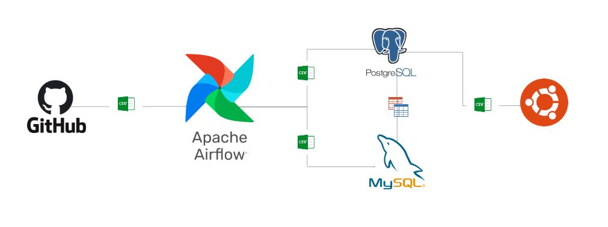
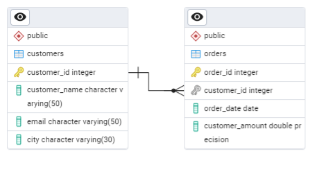
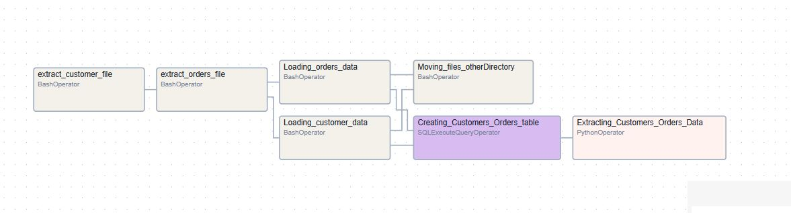

# E-Commerce Data Pipeline with Apache Airflow

## Project Overview

This project demonstrates a **data pipeline for an E-Commerce dataset** using **Apache Airflow**, **MySQL**, and **PostgreSQL**. The pipeline performs **ETL (Extract, Transform, Load)** operations to efficiently ingest, process, and export customer and order data. It also showcases the seamless integration of file-based data with an RDBMS using ETL tools, enabling cross-database connections for data transformation and processing.  

## Architecture

## Dataset Description

This repository contains two datasets used for building a data pipeline: [Repository](Dataset)
1. **customers.csv** – Contains customer-related information such as customer ID, name, contact details, and location.  
2. **orders.csv** – Includes order details such as order ID, customer ID, order date, total amount, and status.
 
## Entity Relationship Diagram for the Dataset(ERD) 

## Technologies Used

- **GitHub** (CSV file storage)
- **Apache Airflow** (Workflow Orchestration)
- **PostgreSQL** (Orders Data & Transformation)
- **MySQL** (Customers Data Storage)
- **Foreign Data Wrapper (FDW)** (Cross-database queries)
- **Python & Pandas** (Data Processing)
- **Ubuntu** (Operating System)
- **pgAdmin 4** (ERD Generation)
- **Lucidchart** (Architecture Diagram)
  
## Data Flow Architecture

1. **Extract Data**: Download CSV files from a remote GitHub repository using `wget`.
2. **Load Data**:
   - Load `customers.csv` into **MySQL** using `LOAD DATA INFILE`.
   - Load `orders.csv` into **PostgreSQL** using `COPY`.
3. **Transform Data**:
   - Use **PostgreSQL FDW** (Foreign Data Wrapper) to join MySQL and PostgreSQL data.
   - Store the transformed results in **PostgreSQL**.
4. **Export Processed Data**: Save the final output as a CSV file.
5. **Logging & Monitoring**:
   - Detailed logs for tracking execution steps.
   - Airflow UI for DAG execution monitoring.

## Airflow : 

 - Data Pipeline Code : [Dag_script](ecommerce_pipeline.py)
 
 - Dag : 

 - Required Airflow and python packages :

    - apache-airflow-providers-common-sql
    - postgresql-16-mysql-fdw (for version 16)
    - apache-airflow-providers-postgres
    - apache-airflow-providers-mysql
    - pandas
      
 - Create Airflow Connections : [Airflow_Instructions](Airflow_Connections.docx)

## Environment setup : [Instructions](Linux_Environment_Setup.docx)

## Future Enhancements

- Automate deployment using **GitHub Actions (CI/CD)**.
- Migrate to **Cloud Platforms (AWS/Azure Data Services)**.
- Optimize transformations with **Apache Spark**.

---

📢 **Author**: Lokesh | 🔗 [LinkedIn Profile](https://www.linkedin.com/in/yourprofile)

